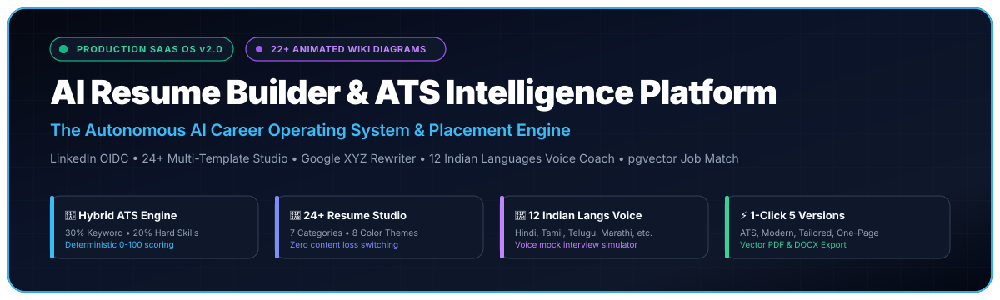

# -AI-Resume-Builder-ATS-Intelligence-Platform

<div align="center">



<br/><br/>

[](https://github.com/Ranjeet7680/-AI-Resume-Builder-ATS-Intelligence-Platform)
[](https://opensource.org/licenses/MIT)
[](https://python.org)
[](https://fastapi.tiangolo.com)
[](https://nextjs.org)
[](https://typescriptlang.org)
[](https://tailwindcss.com)
[](https://github.com/pgvector/pgvector)
[](https://docker.com)
[](https://vercel.com)
[](https://github.com/Ranjeet7680/-AI-Resume-Builder-ATS-Intelligence-Platform/wiki)

<br/>

### 🎯 The Autonomous AI Career Operating System & ATS Placement Engine
**Accelerate from Zero to FAANG/Tier-1 Offer with LinkedIn OIDC, 24+ Multi-Template Studio, Google XYZ Rewriter, 12 Indian Languages Voice AI, and Deterministic ATS Diagnostics.**

<br/>

<p>
  <a href="https://github.com/Ranjeet7680/-AI-Resume-Builder-ATS-Intelligence-Platform/wiki">
    
  </a>
  <a href="#-quickstart-local-development">
    
  </a>
  <a href="#-deployment-guide-vercel--backend">
    
  </a>
  <a href="#-api-endpoints-reference">
    
  </a>
</p>

</div>

---

## 📚 Official Documentation Wiki (22+ Animated Diagrams)

> 🚀 **Deep-dive architectural documentation is published on the [Official GitHub Wiki](https://github.com/Ranjeet7680/-AI-Resume-Builder-ATS-Intelligence-Platform/wiki).**
> Every subsystem features dedicated animated SVG diagrams, architectural workflows, and step-by-step guides:

| Wiki Module | Core Topics | Animated Diagrams |
|---|---|---|
| [**01. System Architecture**](https://github.com/Ranjeet7680/-AI-Resume-Builder-ATS-Intelligence-Platform/wiki/01-System-Architecture) | Master System Overview • Candidate Lifecycle • Gemini 1.5 Pro/Flash Routing | [Overview](./docs/diagrams/diagram-01-system-overview.svg), [Lifecycle](./docs/diagrams/diagram-21-user-journey-lifecycle.svg), [AI Orchestrator](./docs/diagrams/diagram-18-ai-orchestration-gemini.svg) |
| [**02. Authentication & Security**](https://github.com/Ranjeet7680/-AI-Resume-Builder-ATS-Intelligence-Platform/wiki/02-Authentication-and-Security) | LinkedIn OpenID Connect (OIDC) • HttpOnly Sessions • RBAC • Row-Level Security | [LinkedIn OIDC](./docs/diagrams/diagram-02-auth-oidc-flow.svg), [Security](./docs/diagrams/diagram-17-multi-tenant-security.svg) |
| [**03. Resume Ingestion & Parsing**](https://github.com/Ranjeet7680/-AI-Resume-Builder-ATS-Intelligence-Platform/wiki/03-Resume-Ingestion-and-Parsing) | PyMuPDF Ingestion • Zero-Hallucination Fact Store • Vector PDF & DOCX Export | [Parser Pipeline](./docs/diagrams/diagram-03-pdf-parser-pipeline.svg), [Export Engine](./docs/diagrams/diagram-15-export-pdf-docx-engine.svg) |
| [**04. ATS Scoring & Job Match**](https://github.com/Ranjeet7680/-AI-Resume-Builder-ATS-Intelligence-Platform/wiki/04-ATS-Scoring-and-Job-Matching) | Hybrid ATS Engine (30% Keyword, 20% Hard Skills, 20% STAR) • Cosine Similarity | [ATS Hybrid Scorer](./docs/diagrams/diagram-04-ats-hybrid-scorer.svg), [Job Matcher](./docs/diagrams/diagram-07-job-description-matcher.svg) |
| [**05. AI Content Optimization**](https://github.com/Ranjeet7680/-AI-Resume-Builder-ATS-Intelligence-Platform/wiki/05-AI-Content-Optimization) | Google XYZ Rewriter • STAR Assistant • Contextual Multi-Tone Cover Letters | [Google XYZ Rewriter](./docs/diagrams/diagram-05-google-xyz-rewriter.svg), [Cover Letter AI](./docs/diagrams/diagram-13-cover-letter-generator.svg) |
| [**06. Multi-Template Studio**](https://github.com/Ranjeet7680/-AI-Resume-Builder-ATS-Intelligence-Platform/wiki/06-Multi-Template-Studio) | Decoupled Presentation • 24+ Designs across 7 Industry Families • Live Themes | [Template Engine](./docs/diagrams/diagram-06-template-rendering-engine.svg) |
| [**07. Voice AI & Interview Prep**](https://github.com/Ranjeet7680/-AI-Resume-Builder-ATS-Intelligence-Platform/wiki/07-Voice-AI-and-Interview-Prep) | Real-time Voice Coach (12 Indian Languages) • Mock Interview Evaluator | [Voice AI Flow](./docs/diagrams/diagram-08-career-coach-voice-flow.svg), [Mock Simulator](./docs/diagrams/diagram-09-mock-interview-simulator.svg) |
| [**08. Profile Optimizers**](https://github.com/Ranjeet7680/-AI-Resume-Builder-ATS-Intelligence-Platform/wiki/08-External-Profile-Optimizers) | LinkedIn 360° Profile Audit • GitHub Developer Footprint & Proof-of-Work | [LinkedIn Optimizer](./docs/diagrams/diagram-10-linkedin-optimizer.svg), [GitHub Analyzer](./docs/diagrams/diagram-11-github-repo-analyzer.svg) |
| [**09. Kanban & Career Roadmap**](https://github.com/Ranjeet7680/-AI-Resume-Builder-ATS-Intelligence-Platform/wiki/09-Application-Kanban-and-Roadmap) | Application Pipeline Kanban • 90-Day Skill Gap Radar & Milestone Execution | [Kanban Pipeline](./docs/diagrams/diagram-12-kanban-application-tracker.svg), [Skill Gap Radar](./docs/diagrams/diagram-14-skill-gap-radar.svg) |
| [**10. Database, DevOps & SaaS Admin**](https://github.com/Ranjeet7680/-AI-Resume-Builder-ATS-Intelligence-Platform/wiki/10-Admin-DevOps-and-Database) | PostgreSQL 16 + pgvector ER • CI/CD Pipeline • Admin Telemetry & Tip Engine | [Database Schema](./docs/diagrams/diagram-16-database-schema-er.svg), [Admin Telemetry](./docs/diagrams/diagram-19-admin-telemetry-engine.svg), [CI/CD](./docs/diagrams/diagram-20-ci-cd-devops-pipeline.svg), [Promo Tips](./docs/diagrams/diagram-22-promotions-tips-engine.svg) |

---

## 🎨 Interactive Master Architecture Diagram

<div align="center">


</div>

---

## 🌟 Complete User Journey Flow

```text
WELCOME / SPLASH SCREEN (/welcome)
        ↓
LANDING PAGE (/)
        ↓
LOGIN / SIGN UP (/login, /signup)
        ↓
ONBOARDING WIZARD (/onboarding)
        ↓
CENTRAL COMMAND DASHBOARD (/dashboard)
        │
        ├── 👤 Candidate Profile & Bio (/profile)
        ├── 📄 WYSIWYG Resume Builder (/builder/new, /builder/[id])
        ├── 🩺 7-Factor Resume Diagnostic (/resume-health)
        ├── 🎨 24+ Multi-Template Studio (/templates)
        ├── 🎯 AI Job Match & Tailor (/tailor)
        ├── 🔍 ATS Parser & Compatibility Checker (/ats-analyzer)
        ├── 💡 Skill Gap & Career Roadmap (/resume-health)
        ├── ✉️ AI Cover Letter Generator (/cover-letter)
        ├── 🤖 Conversational AI Career Coach (/career-coach)
        ├── 🎤 Voice Assistant & 12 Indian Languages (/career-coach)
        ├── 🏆 Voice Mock Interview Simulator (/career-coach)
        ├── 🔗 LinkedIn Profile Optimizer (/linkedin)
        ├── 🐙 GitHub Repository Analyzer (/github)
        ├── 📈 Application Pipeline Kanban (/applications)
        ├── 📊 Career & Visibility Analytics (/analytics)
        ├── ⚙️ Functional Settings Hub (/settings)
        ├── 📢 Contextual Promotion & Tip Engine (/components/common/PromotionBanner.tsx)
        └── 🛠️ Admin Dashboard & Campaign Manager (/admin)
```

---

## ✨ Features and Capabilities

### 1. 🔐 Authentication & Zero-Hallucination Import
- **LinkedIn OpenID Connect (OIDC)**: Secure authorization flow with `openid`, `profile`, and `email` scopes.
- **LinkedIn Profile PDF Ingestion**: Client-side & server-side parser for official LinkedIn PDF exports (`More ➔ Save to PDF`) to bypass third-party API restrictions.
- **Multi-Provider Auth**: Google OAuth, GitHub, Email/Password, and 1-Click Sandbox Demo login.

### 2. 🎨 Multi-Template Resume Studio (24+ Designs Across 7 Categories)
- **Content-Presentation Decoupling**: Candidate career facts are never modified or lost when cycling through designs.
- **7 Industry Categories**:
  - **ATS-Friendly (100% Guaranteed)**: Minimalist, Classic Ivy, One-Page Compact, Corporate, EuroPass.
  - **Modern Professional**: Modern Blue, Minimal Slate, Split Two-Column, Clean Executive, Visual Timeline.
  - **Tech & Software**: Software Engineer Pro (FAANG-tested), Full-Stack Split, Frontend Specialist, Backend/Cloud Architect, DevOps/SRE.
  - **Data & AI**: AI/ML Specialist (GenAI & LLMs), Data Scientist Analytics, Generative AI Architect, Data Platform Engineer.
  - **Student & Fresher**: Campus Fresher Classic, Student Internship, BTech Placement Standard (IIT/NIT drive ready).
  - **Executive & Leadership**: Executive Leadership Classic, Director & VP Strategy.
  - **Creative & Startup**: Creative Modern Impact, Startup Impact & Growth.
- **Dynamic Design Engine**: Live customization of 8 typography font families (`Inter`, `Roboto`, `Open Sans`, `Lato`, `Poppins`, `Montserrat`, `Merriweather`, `Georgia`), 8 color palettes, 4 layout modes (`single`, `two-column`, `compact`, `timeline`), and header styles.
- **✨ AI Design Recommender**: Analyzes target role, seniority level, and job description to recommend top 3 templates with strategic hiring rationale.
- **⚡ 1-Click "Create 5 Versions" Generator**: Instantly spawns 5 specialized records (ATS Minimalist, Modern Professional, Role-Tailored, Compact One-Page, Vanity Public Link) with direct download bundles.

### 3. 🎯 AI Bullet Rewriter & STAR Method
- **Google XYZ Formula**: Automatically rewrites passive bullet points into high-impact quantified achievements:
  $$\text{Accomplished [X], as measured by [Y], by doing [Z]}$$
- **Interactive STAR Builder Modal**: Guided step-by-step assistant for Situation, Task, Action, and Result.

### 4. 🔍 Hybrid ATS Compliance Engine
- Computes deterministic scores (0–100) based on:
  - 30% Target role keyword density and exact match
  - 20% Hard technical skills & framework coverage
  - 20% Action verb punchiness (Harvard/Google action verb dictionary)
  - 15% Measurable outcome metrics & numbers
  - 15% Formatting compliance (single-column parsing check)

### 5. 🤖 Voice Career Assistant & 12 Indian Languages
- **Conversational Speech AI**: Speech-to-Text (STT) and Text-to-Speech (TTS) with real-time browser audio playback.
- **Indian Language Support**: Native support for **Hindi (हिंदी / Hinglish)**, **Bengali (বাংলা)**, **Marathi (मराठी)**, **Gujarati (ગુજરાતી)**, **Tamil (தமிழ்)**, **Telugu (తెలుగు)**, **Kannada (ಕನ್ನಡ)**, **Malayalam (മലയാളം)**, **Punjabi (ਪੰਜਾਬੀ)**, **Odia (ଓଡ଼ିଆ)**, **Assamese (অসমীয়া)**, and **English**.
- **Voice Mock Interview Simulator**: Technical, HR, Behavioral, and Project rounds with question generation, speech response transcription, and scoring breakdown.

### 6. 🐙 GitHub Repository Analyzer
- Connects GitHub handles to analyze public repositories, languages, stars, and commit patterns.
- Auto-synthesizes quantified resume project bullet points with 1-click **"Add to Resume Projects"**.

### 7. 🔗 LinkedIn Profile Optimizer
- Generates high-converting headlines optimized for LinkedIn Recruiter search algorithms.
- Formats engaging **About** summaries and recommends featured skills.

### 8. 📈 Kanban Application Tracker Pipeline
- Full 6-stage Kanban board: `Saved` $\to$ `Applied` $\to$ `Screening` $\to$ `Interview` $\to$ `Offer Received` $\to$ `Archived / Rejected`.
- Stores company, role, location, salary range, interview dates, resume version linkage, and notes.

### 9. 📊 Career & Visibility Analytics
- Visualizes resume views, `.docx` downloads, `.txt` exports, ATS diagnostic dimension scores (Formatting, Verbs, Skills, Metrics), and a 7-day application pulse chart.

### 10. ⚙️ Functional Settings Hub & Data Hygiene Wiping
- **Account**: Credentials and permanent account deletion.
- **Appearance**: Light / Dark / System theme switcher.
- **Language**: English + 11 Indian languages.
- **Voice**: Speech speed slider ($0.75\times - 1.5\times$), auto-play toggle, and live voice tester.
- **Notifications**: Email digests, interview calendar reminders, and pipeline alerts.
- **Privacy & Data Hygiene**: Public vanity profile visibility toggle + 1-click **"Wipe All AI History"** (permanently wipes chat conversations, voice recordings, and mock interview transcripts).
- **Integrations**: LinkedIn and GitHub connection status.
- **Billing**: Active plan management and invoice history.

### 11. 🛠️ Admin Dashboard & Campaign Manager
- **Platform Metrics**: Total Users ($1,420+$), Active Subscriptions ($380$), Resumes Created ($4,890+$), MRR (₹$189,500$), and System Uptime ($99.98\%$).
- **Campaign / Ad Manager**: Create, target, toggle ON/OFF non-intrusive career tip banners and track impressions/clicks.
- **Template Directory**: Live status and ATS score tags for all 24+ resume designs.

### 12. 📤 Multi-Format Export
- **Microsoft Word (`.docx`)**: Clean tables, standard bullet points, and ATS margins.
- **Print / PDF**: Pixel-perfect printable CSS layout.
- **Plain-Text ASCII (`.txt`)**: Clean text format for copy-pasting directly into ATS portal textareas.
- **Vanity Public Web Link**: Shareable candidate link (`/r/[slug]`) with view metrics.

---

## 📂 Project Structure

```text
wise-fermi/
├── docs/
│   └── architecture-diagram.svg         # Animated SVG architecture diagram
├── docker-compose.yml                   # Container stack (Postgres + pgvector + Redis + App)
├── render.yaml                          # One-click Render infrastructure blueprint
├── vercel.json                          # Monorepo Vercel configuration
├── backend/                             # FastAPI Python Async Backend
│   ├── Dockerfile
│   ├── Procfile                         # Cloud deployment entrypoint
│   ├── requirements.txt
│   ├── tests/                           # Pytest test suites (100% pass)
│   │   ├── test_chat.py
│   │   ├── test_saas.py
│   │   ├── test_smoke.py
│   │   └── test_templates.py
│   └── app/
│       ├── main.py                      # App entrypoint, CORS, routers
│       ├── config.py                    # Pydantic Settings
│       ├── database.py                  # Async SQLAlchemy + pgvector + fallback SQLite
│       ├── models/                      # User, Resume, JobMatch, Application, Campaign
│       ├── schemas/                     # Pydantic v2 validation models
│       ├── api/                         # REST API endpoints (Auth, Resume, Templates, etc.)
│       └── services/                    # Business logic (AI Engine, Templates, GitHub, etc.)
└── frontend/                            # Next.js 14 App Router Frontend
    ├── vercel.json                      # Vercel deployment configuration
    ├── package.json
    ├── tailwind.config.ts
    ├── public/
    │   └── architecture-diagram.svg
    └── src/
        ├── app/                         # App Router (25 static & dynamic pages)
        │   ├── page.tsx                 # SaaS Landing page
        │   ├── welcome/                 # Animated splash screen
        │   ├── login/ & signup/         # Multi-provider auth
        │   ├── onboarding/              # 4-step personalization wizard
        │   ├── dashboard/               # Central command center
        │   ├── builder/                 # WYSIWYG Resume editor
        │   ├── templates/               # 24+ Multi-Template Studio
        │   ├── applications/            # Kanban application tracker
        │   ├── career-coach/            # Conversational & Voice AI Coach
        │   ├── github/                  # GitHub repository analyzer
        │   ├── linkedin/                # LinkedIn profile optimizer
        │   ├── profile/                 # Candidate master profile
        │   ├── settings/                # Functional settings hub
        │   ├── admin/                   # Admin portal & campaign manager
        │   ├── analytics/               # Career search metrics
        │   ├── ats-analyzer/            # ATS parser & score diagnostic
        │   ├── cover-letter/            # Cover letter synthesizer
        │   ├── resume-health/           # 7-factor diagnostic & roadmap
        │   ├── tailor/                  # AI job description tailoring
        │   └── r/[slug]/                # Vanity public resume link
        ├── components/
        │   ├── common/                  # PromotionBanner, Theme toggles
        │   ├── layout/                  # Navbar with quick search & profile menu
        │   ├── resume/                  # Dynamic ResumePreview with 4 layout modes
        │   └── ai/                      # Persistent floating AiCareerAssistant widget
        ├── store/                       # Zustand real-time editor state
        ├── types/                       # TypeScript interfaces (saas, template, resume)
        └── lib/                         # Typed API client
```

---

## ⚡ Quickstart (Local Development)

### 1. Prerequisites
- **Node.js**: v18.x or v20.x
- **Python**: 3.10+ (Recommended: 3.11)
- **Docker** *(optional, for full Postgres + pgvector stack)*

### 2. Backend Setup
```bash
cd backend
python -m venv .venv

# On Windows:
.\.venv\Scripts\activate
# On Linux/macOS:
# source .venv/bin/activate

pip install -r requirements.txt
uvicorn app.main:app --reload --port 8000
```
> **Note**: If PostgreSQL is not running locally, the backend automatically boots with a local asynchronous SQLite database at `./resume_builder.db`.

### 3. Frontend Setup
```bash
cd frontend
npm install
npm run dev
```
Open **[http://localhost:3000](http://localhost:3000)** in your browser.

---

## ☁️ Deployment Guide (Vercel & Backend)

### Deploy Frontend to Vercel (1-Click)

1. Push this repository to your GitHub account:
   ```bash
   git remote add origin https://github.com/Ranjeet7680/-AI-Resume-Builder-ATS-Intelligence-Platform.git
   git branch -M main
   git push -u origin main
   ```
2. Go to **[Vercel Dashboard](https://vercel.com/new)** and click **Import Repository**.
3. Select your repository `Ranjeet7680/-AI-Resume-Builder-ATS-Intelligence-Platform`.
4. Configure Project Settings:
   - **Root Directory**: `frontend` (or leave root as `vercel.json` automatically configures it)
   - **Framework Preset**: `Next.js`
   - **Build Command**: `npm run build`
   - **Output Directory**: `.next`
5. Add Environment Variables:
   ```env
   NEXT_PUBLIC_API_URL=https://your-backend-api-domain.com/api/v1
   ```
6. Click **Deploy**. Vercel will build and launch your production web app in under 2 minutes!

---

### Deploy Backend (Render, Railway, Fly.io, or VPS)

#### Option A: One-Click Render Blueprint
This repository includes a [`render.yaml`](./render.yaml) file.
1. Connect your GitHub repository to **[Render](https://dashboard.render.com/)**.
2. Select **New ➔ Blueprint** and pick this repository.
3. Render automatically provisions:
   - Python FastAPI Web Service (`ai-resume-backend`)
   - Managed PostgreSQL 16 Database (`ai-resume-db`)
   - Auto-configured environment variables.

#### Option B: Docker Compose (Self-Hosted VPS / AWS EC2)
```bash
docker compose up -d --build
```
This launches:
- `backend`: FastAPI app running on port 8000
- `frontend`: Next.js production server running on port 3000
- `postgres`: PostgreSQL 16 with `pgvector` enabled on port 5432
- `redis`: Redis server for caching on port 6379

---

## 📖 API Endpoints Reference

| Method | Endpoint | Description |
| :--- | :--- | :--- |
| `GET` | `/templates` | List all 24+ professional resume templates across 7 categories |
| `POST` | `/templates/recommend` | AI layout recommendation based on role, level, and job description |
| `POST` | `/templates/create-5-versions` | 1-Click generator creating 5 targeted resume variations |
| `GET` | `/api/v1/export/{id}/docx` | Export resume as Microsoft Word document |
| `GET` | `/api/v1/export/{id}/txt` | Export resume as clean Plain-Text ASCII for ATS textareas |
| `POST` | `/api/v1/chat/message` | Conversational Career AI text coaching |
| `POST` | `/api/v1/chat/voice` | Voice-to-Voice AI career advice & transcription |
| `POST` | `/api/v1/speech/synthesize` | TTS audio generation for 12 Indian languages + English |
| `POST` | `/api/v1/interview/start` | Launch voice mock interview simulation session |
| `POST` | `/api/v1/interview/answer` | Submit interview answer & receive instant speech feedback |
| `POST` | `/api/v1/interview/evaluate` | Generate comprehensive performance scorecard & rubric |
| `GET` | `/api/v1/applications` | Retrieve user's Kanban job application tracker pipeline |
| `POST` | `/api/v1/applications` | Create new job application entry |
| `POST` | `/api/v1/github/analyze` | Parse GitHub repositories & generate quantified resume projects |
| `POST` | `/api/v1/ai/optimize-linkedin` | Generate high-converting headlines & About sections |
| `GET` | `/api/v1/profile` | Get candidate master profile & completeness meter |
| `GET` | `/api/v1/analytics` | Get resume views, downloads, and conversion metrics |
| `GET` | `/api/v1/admin/stats` | Platform operational statistics and health |
| `GET` | `/api/v1/admin/campaigns` | Active promotion & career tip campaigns |

---

## 🧪 Automated Testing

Both backend and frontend have automated test suites:

```bash
# Run full backend test suite (Chat, Templates, SaaS, Smoke)
cd backend
.\.venv\Scripts\pytest -v

# Run frontend production type checking and compilation
cd frontend
npm run build
```

---

## 📄 License

This project is licensed under the [MIT License](LICENSE).
